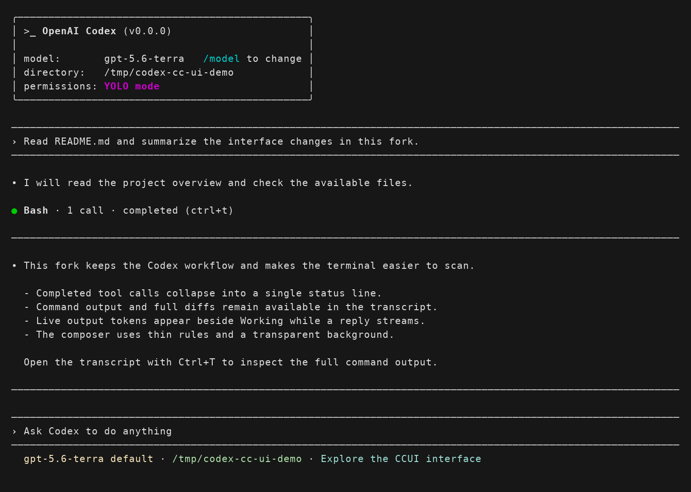
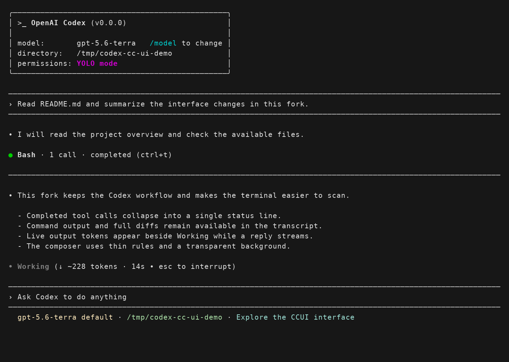

# codex-claude-code-ui

**给 Codex CLI 换上 Claude Code 风格的紧凑终端界面。**

`codex-cc-ui` 是基于 [openai/codex](https://github.com/openai/codex) 的社区 fork，直接修改原生 Rust TUI，让工具调用、命令结果和代码变更更便于浏览。界面参考 [pi-claude-code-ui](https://github.com/FammasMaz/pi-cc-tools)。

保留 Codex 的代理执行、模型配置、权限控制和会话机制。本项目不是 Codex 插件，也不是 Claude Code 客户端；界面风格不会改变所使用的模型或服务商。

[实现说明](CCUI.md) · [发行页面](https://github.com/Zrzzzz/codex-cc-ui/releases) · [反馈问题](https://github.com/Zrzzzz/codex-cc-ui/issues)

## 界面预览





## 界面变化

| 区域             | 行为                                                          |
| ---------------- | ------------------------------------------------------------- |
| 输入框与用户消息 | 透明背景、细横线分隔，减少视觉占用                            |
| 工具状态         | 实心状态点，成功显示绿色，失败显示红色                        |
| Shell / MCP 调用 | 执行中保留实时预览，完成后收起详情、显示状态摘要              |
| 文件修改         | 主界面显示文件和变更统计，完整 diff 保留在 transcript 中      |
| 输出统计         | `Working` 旁显示本轮输出 token 数和耗时，流式回复期间持续更新 |
| 完整记录         | `Ctrl+T` 打开 transcript，查看命令输出、MCP 文本及 diff       |

手动输入的 Shell 命令仍保留可见输出。主界面收起详情不会删除完整记录。

实时 token 数包含收到的文本、推理和工具输入片段，不包含工具 stdout。带 `~` 的数值是按 UTF-8 字节数估算的结果，服务端返回实际用量后会校正。如果服务商缓冲了流式内容，计数也会等到收到内容后再更新。

## 获取与运行

当前开发分支为 **`ccui`**。首个预发行版为 [v0.1.0-alpha.1](https://github.com/Zrzzzz/codex-cc-ui/releases/tag/v0.1.0-alpha.1)，支持 **Linux x86_64、glibc 2.39+、OpenSSL 3**。暂不提供 macOS、Windows、ARM64 或 Alpine/musl 发行包。

### 通过 npm 安装发行包

```sh
npm install -g https://github.com/Zrzzzz/codex-cc-ui/releases/download/v0.1.0-alpha.1/codex-cc-ui-0.1.0-alpha.1.tgz
codex-cc
```

这是安装 GitHub Release 中的 npm 格式包，尚未发布到 npm registry。安装后使用独立命令 `codex-cc`，不会覆盖官方 `codex`。`npm install -g @openai/codex` 安装的仍是官方版本。

### 下载独立压缩包

从 [发行页面](https://github.com/Zrzzzz/codex-cc-ui/releases/tag/v0.1.0-alpha.1) 下载 `.tar.gz` 和 `SHA256SUMS`。校验并解压后运行：

```sh
sha256sum --check --ignore-missing SHA256SUMS
tar -xzf codex-cc-ui-0.1.0-alpha.1-x86_64-unknown-linux-gnu.tar.gz
cd codex-cc-ui-0.1.0-alpha.1-x86_64-unknown-linux-gnu
./codex-cc
```

请保留完整目录结构，配套程序已包含在包内。首版采用去除符号的未优化开发构建；原生 CLI 的 `--version` 仍显示 `0.0.0`，实际发行版本、源码提交和文件校验值见包内 `BUILD-INFO.json`。

### 从源码构建

需要 Git、Rust 工具链和平台原生构建依赖。仓库通过 [`rust-toolchain.toml`](codex-rs/rust-toolchain.toml) 固定 Rust 1.95.0。

```sh
git clone --branch ccui https://github.com/Zrzzzz/codex-cc-ui.git
cd codex-cc-ui/codex-rs
CARGO_PROFILE_DEV_DEBUG=0 cargo build --locked -p codex-cli
./target/debug/codex
```

这里运行的是本地构建的二进制，不会覆盖系统已有的 `codex` 命令。它沿用现有 Codex 配置和登录状态；`codex-cc` 是本项目使用的独立启动名称，上述构建命令本身不会安装这个别名。

### Code Mode 配套程序

使用 Code Mode 的模型还需要 `codex-code-mode-host`，放在 `codex` 可执行文件旁边。正常情况下可用以下命令构建：

```sh
CARGO_PROFILE_DEV_DEBUG=0 cargo build --locked -p codex-code-mode-host
```

**当前已知限制：** 本地 Linux 构建所需的 V8 150.4.0 预编译归档缺失，因此 Code Mode host 的源码构建尚未打通。本地开发暂时使用官方 Codex 0.153.4 包中的 host；已有协议握手和基础执行检查记录，但这不代表跨版本完全兼容。不要通过关闭 V8 sandbox 绕过这个问题。具体情况见 [CCUI.md](CCUI.md)。

## 开发与验证

开发约定见 [AGENTS.md](AGENTS.md)，详细界面行为与构建记录见 [CCUI.md](CCUI.md)。安装 `just` 和 `cargo-nextest` 后，可在 `codex-rs` 下运行 TUI 测试：

```sh
env -u NO_COLOR -u TERM_PROGRAM -u TMUX -u TMUX_PANE \
  TERM=xterm-256color CARGO_PROFILE_DEV_DEBUG=0 just test -p codex-tui
just fmt
```

清除这些终端环境变量是为了让颜色和键盘提示快照使用一致的输入。界面变更需要对应的 snapshot 覆盖；修改其他 crate 时也应运行对应测试。

## 上游与致谢

- [OpenAI Codex](https://github.com/openai/codex)：代理运行时、CLI 和原生 TUI。
- [pi-claude-code-ui / pi-cc-tools](https://github.com/FammasMaz/pi-cc-tools)：界面风格参考。
- 本 fork 的初始上游基线：[`5ecb3afd1bf4`](https://github.com/openai/codex/commit/5ecb3afd1bf405149e2159bfda50093b0c1b5fab)。

这是独立维护的社区项目，与 OpenAI、Anthropic 无官方隶属关系。通用 Codex 配置及使用方法可参考 [官方文档](https://developers.openai.com/codex)。

## 许可证

采用 [Apache-2.0](LICENSE) 许可证，保留上游版权声明及 [NOTICE](NOTICE)。
